# Sequence diagram

# Bookmark

### 북마크 추가 / 삭제

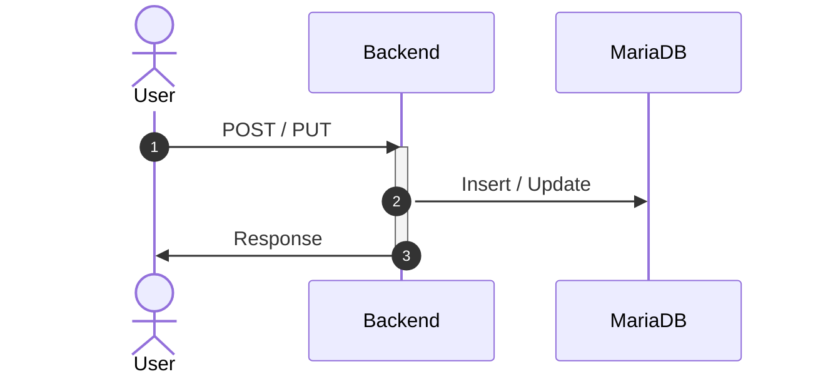
```mermaid
sequenceDiagram
	autonumber
	actor User
	User->>Backend: POST / PUT
	activate Backend
	Backend->>MariaDB: Insert / Update
	Backend->>User: Response
	deactivate Backend
	
```

### 북마크된 피드, 질문, 로드맵 가져오기

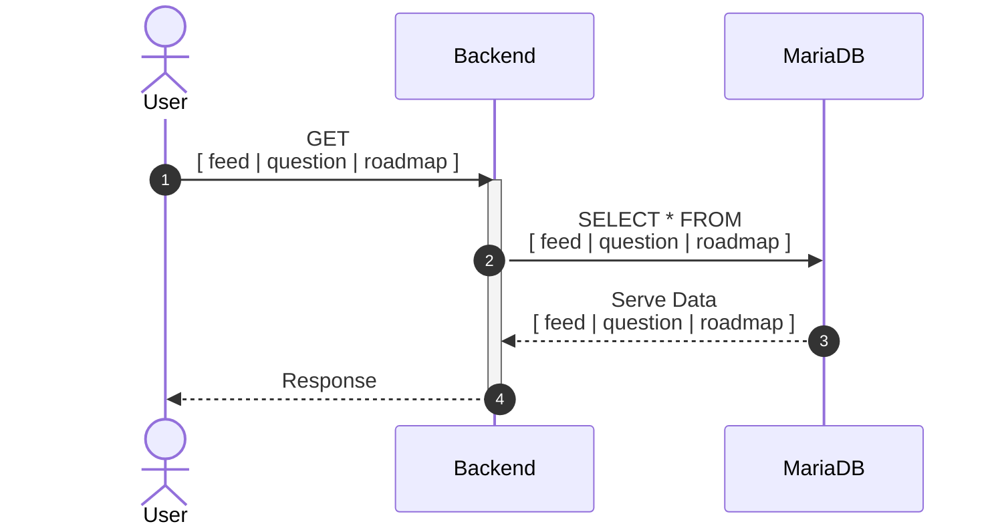
```mermaid
sequenceDiagram
	autonumber
	actor User
	User->>Backend: GET<br>[ feed | question | roadmap ]
	activate Backend
	Backend->>MariaDB: SELECT * FROM<br>[ feed | question | roadmap ]
	MariaDB-->>Backend: Serve Data<br>[ feed | question | roadmap ]
	Backend-->>User: Response
	deactivate Backend

```

# Company

### 회사 정보 조회

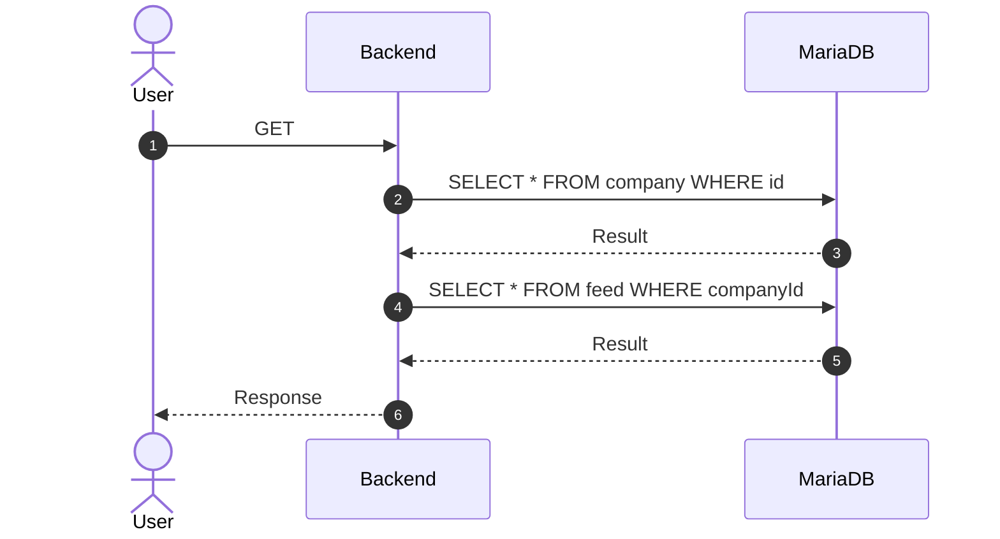
```mermaid
sequenceDiagram
	autonumber
	actor User
	User->>Backend: GET
	Backend->>MariaDB: SELECT * FROM company WHERE id
	MariaDB-->>Backend: Result
	Backend->>MariaDB: SELECT * FROM feed WHERE companyId
	MariaDB-->>Backend: Result
	Backend-->>User: Response
```

### 회사 로고 목록

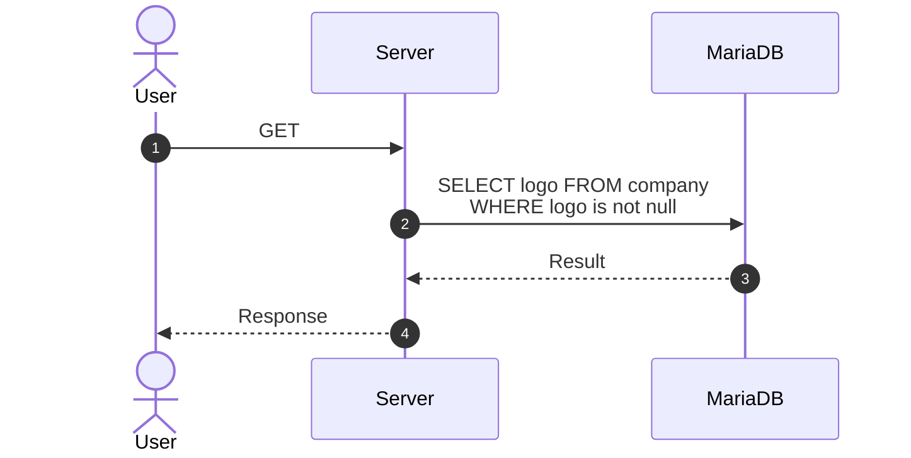
```mermaid
sequenceDiagram
	autonumber
	actor User
	User->>Server: GET
	Server->>MariaDB: SELECT logo FROM company<br>WHERE logo is not null
	MariaDB-->>Server: Result
	Server-->>User: Response
```

# Feed

### 검색

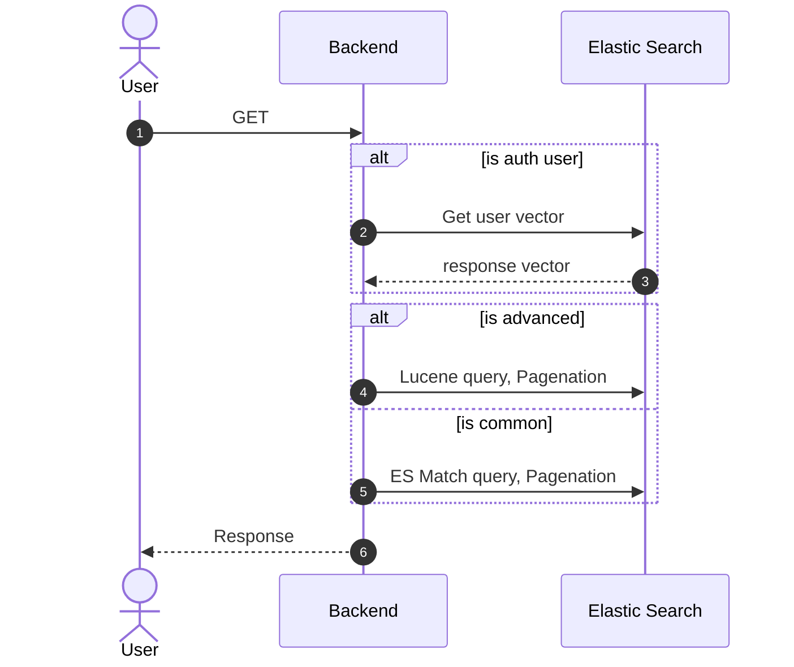
```mermaid
sequenceDiagram
	autonumber
	Actor User
	User->>Backend: GET
	alt is auth user
		Backend->>Elastic Search: Get user vector
		Elastic Search-->>Backend: response vector
	end
	alt is advanced
		Backend->>Elastic Search: Lucene query, Pagenation
	else is common
		Backend->>Elastic Search: ES Match query, Pagenation
	end
	Backend-->>User: Response
```

### 데이터 추가

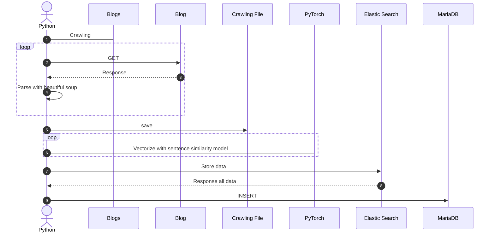
```mermaid
sequenceDiagram
	autonumber
	actor Python
	Python->Blogs: Crawling
	loop
		Python->>Blog: GET
		Blog-->>Python: Response
		Python->>Python: Parse with beautiful soup
	end
	Python->>Crawling File: save
	loop
		Python->PyTorch: Vectorize with sentence similarity model
	end
	Python->>Elastic Search: Store data
	Elastic Search-->>Python: Response all data
	Python->>MariaDB: INSERT
```

# Like

### 좋아요 등록 / 취소

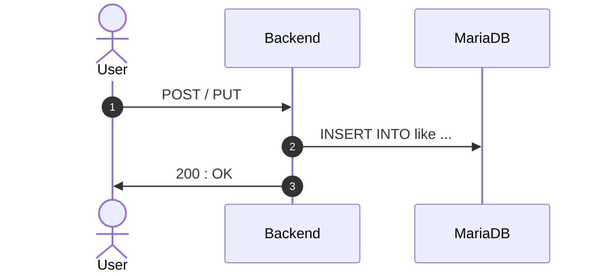
```mermaid
sequenceDiagram
	autonumber
	actor User
	User->>Backend: POST / PUT
	Backend->>MariaDB: INSERT INTO like ...
	Backend->>User: 200 : OK
```

# Notification

### 알림

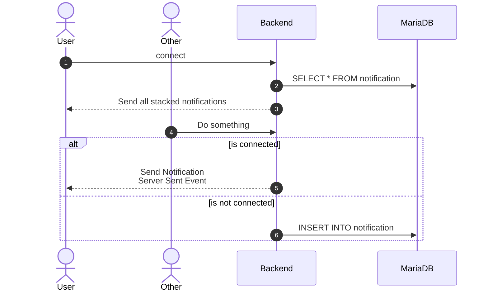
```mermaid
sequenceDiagram
	autonumber
	actor User
	actor Other
	User->>Backend: connect
	Backend->>MariaDB: SELECT * FROM notification
	Backend-->>User: Send all stacked notifications
	Other->>Backend: Do something
	alt is connected
		Backend-->>User: Send Notification<br>Server Sent Event
	else is not connected
		Backend->>MariaDB: INSERT INTO notification
	end
```

# Q&A

### Q&A 등록 / 수정

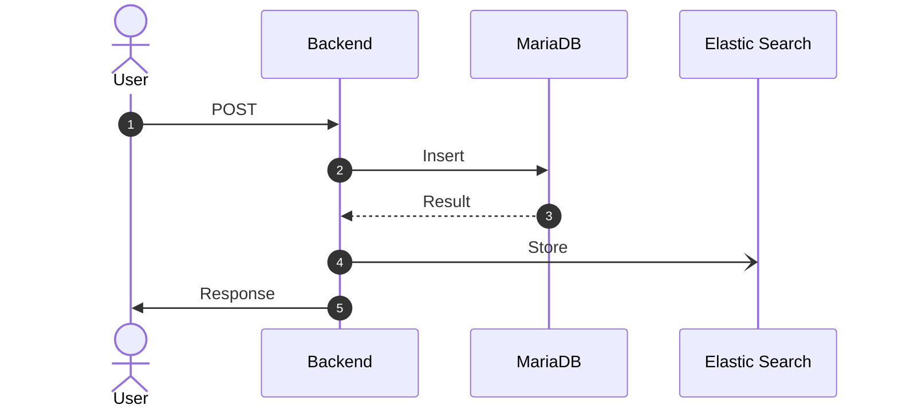
```mermaid
sequenceDiagram
	autonumber
	actor User
	User->>Backend: POST
	Backend->>MariaDB: Insert
	MariaDB-->>Backend: Result
	Backend-)Elastic Search: Store
	Backend->>User: Response
	
```

### 질문 검색

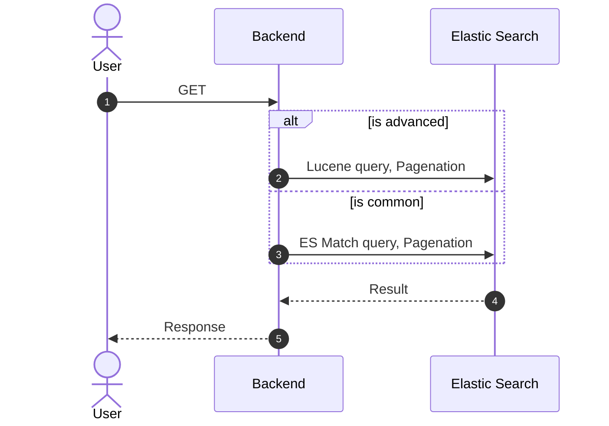
```mermaid
sequenceDiagram
	autonumber
	actor User
	User->>Backend: GET
	alt is advanced
		Backend->>Elastic Search: Lucene query, Pagenation
	else is common
		Backend->>Elastic Search: ES Match query, Pagenation
	end
	Elastic Search-->>Backend: Result
	Backend-->>User: Response
```

### 답변 등록

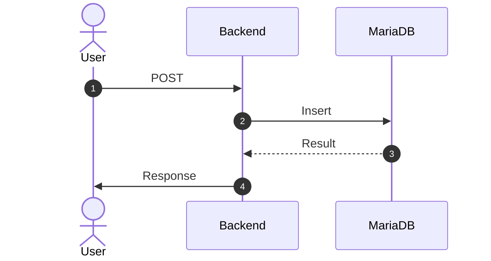
```mermaid
sequenceDiagram
	autonumber
	actor User
	User->>Backend: POST
	Backend->>MariaDB: Insert
	MariaDB-->>Backend: Result
	Backend->>User: Response
```

# Roadmap

### 로드맵 생성 / 수정 / 삭제

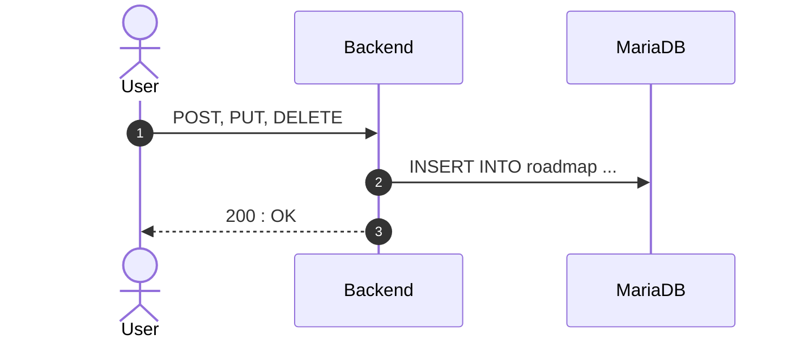
```mermaid
sequenceDiagram
	autonumber
	actor User
	User->>Backend: POST, PUT, DELETE
	Backend->>MariaDB: INSERT INTO roadmap ...
	Backend-->>User: 200 : OK
```

### 로드맵 조회

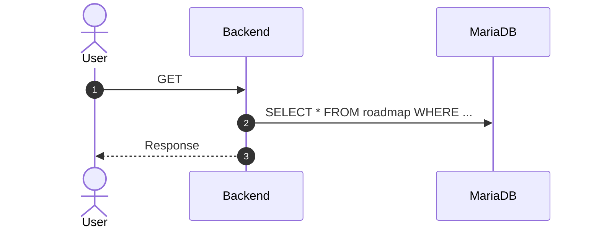
```mermaid
sequenceDiagram
	autonumber
	actor User
	User->>Backend: GET
	Backend->>MariaDB: SELECT * FROM roadmap WHERE ...
	Backend-->>User: Response
```

# Token

### 만료 상태 조회

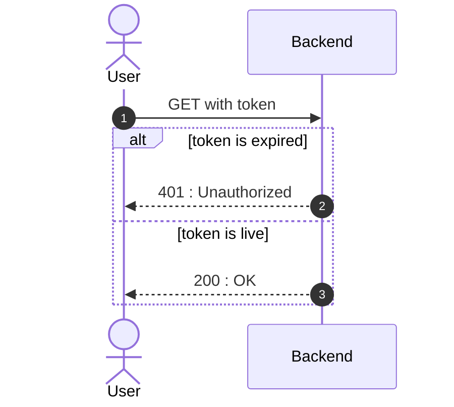
```mermaid
sequenceDiagram
	autonumber
	actor User
	User->>Backend: GET with token
	alt token is expired
		Backend-->>User: 401 : Unauthorized
	else token is live
		Backend-->>User: 200 : OK
	end
```

### 재발급

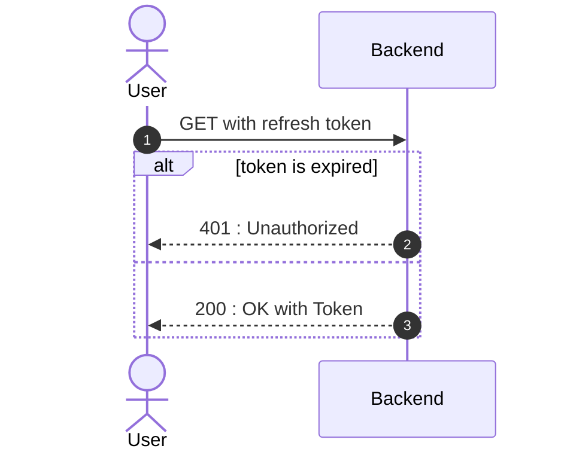
```mermaid
sequenceDiagram
	autonumber
	actor User
	User->>Backend: GET with refresh token
	alt token is expired
		Backend-->>User: 401 : Unauthorized
	else
		Backend-->>User: 200 : OK with Token
	end
```

# User

### 로그인 / 회원가입

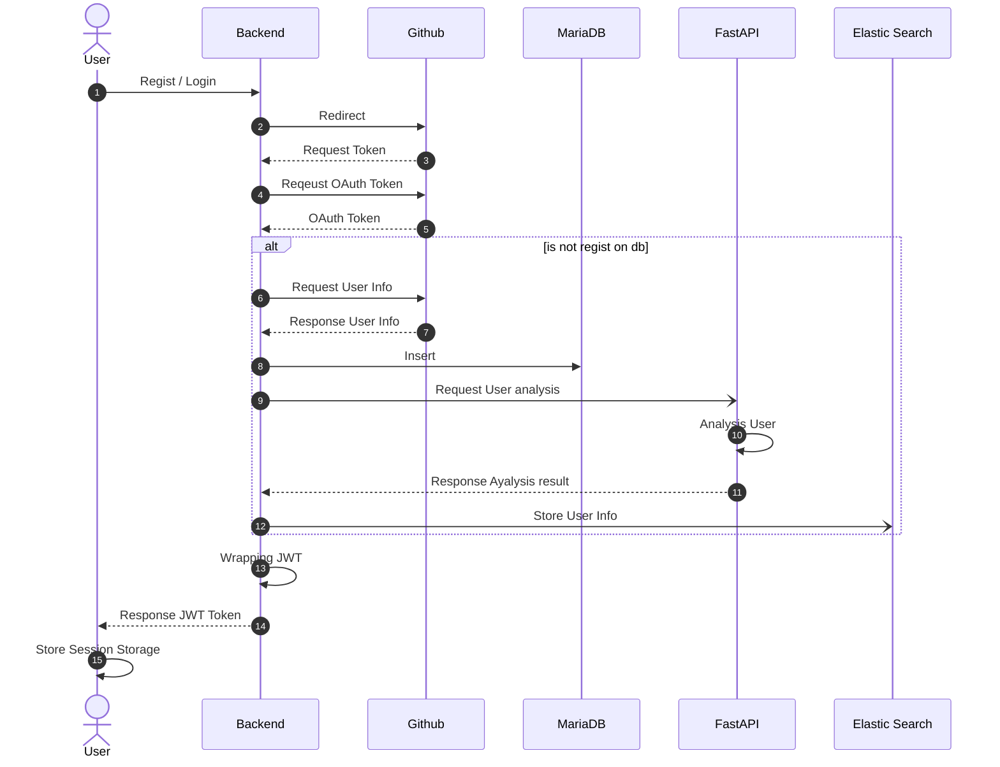
```mermaid
sequenceDiagram
	autonumber
	actor User
	User->>Backend: Regist / Login
	Backend->>Github: Redirect
	Github-->>Backend: Request Token
	Backend->>Github: Reqeust OAuth Token
	Github-->>Backend: OAuth Token
	alt is not regist on db
		Backend->>Github: Request User Info
		Github-->>Backend: Response User Info
		Backend->>MariaDB: Insert
		Backend-)FastAPI: Request User analysis
		FastAPI->>FastAPI: Analysis User
		FastAPI-->>Backend: Response Ayalysis result
		Backend-)Elastic Search: Store User Info
	end
	Backend->>Backend: Wrapping JWT
	Backend-->>User: Response JWT Token
	User->>User: Store Session Storage
```

### 질문 / 답변 목록

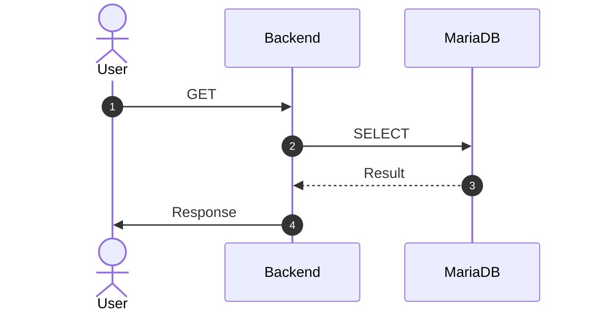
```mermaid
sequenceDiagram
	autonumber
	actor User
	User->>Backend: GET
	Backend->>MariaDB: SELECT
	MariaDB-->>Backend: Result
	Backend->>User: Response
	
```

### 최근 활동

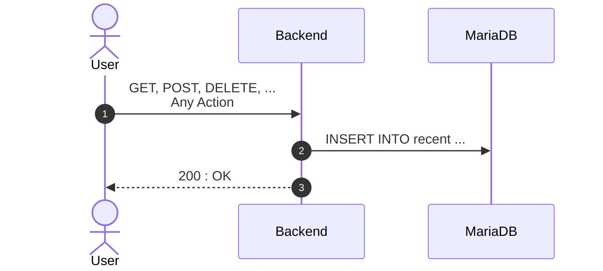
```mermaid
sequenceDiagram
	autonumber
	actor User
	User->>Backend: GET, POST, DELETE, ...<br>Any Action
	Backend->>MariaDB: INSERT INTO recent ...
	Backend-->>User: 200 : OK
```

### 뱃지 목록

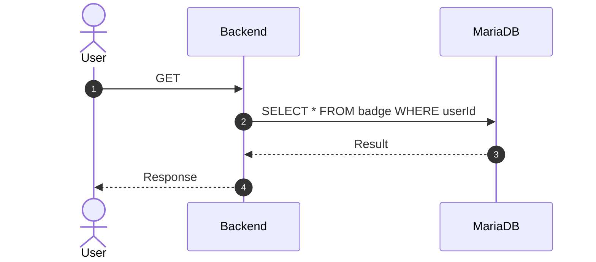
```mermaid
sequenceDiagram
	autonumber
	actor User
	User->>Backend: GET
	Backend->>MariaDB: SELECT * FROM badge WHERE userId
	MariaDB-->>Backend: Result
	Backend-->>User: Response
```

### 구독

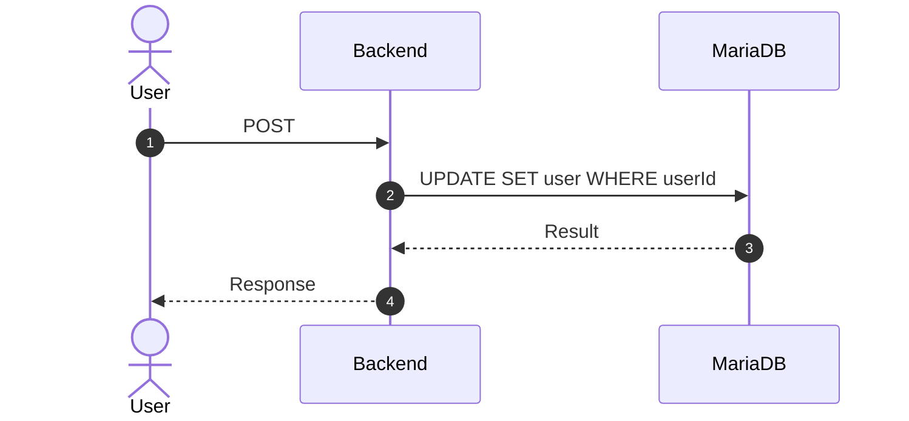
```mermaid
sequenceDiagram
	autonumber
	actor User
	User->>Backend: POST
	Backend->>MariaDB: UPDATE SET user WHERE userId
	MariaDB-->>Backend: Result
	Backend-->>User: Response
```

### 팔로우 추가 / 삭제

```mermaid
sequenceDiagram
	autonumber
	actor User
	User->>Backend: POST, PUT
	Backend->>MariaDB: INSERT INTO follow ...
	MariaDB-->>Backend: Result
	Backend-->>User: Response
```

### 팔로잉 / 팔로워 목록

```mermaid
sequenceDiagram
	autonumber
	actor User
	User->>Backend: GET
	Backend->>MariaDB: SELECT * FROM follow WHERE userId LIMIT 1;
	MariaDB-->>Backend: Result
	Backend-->>User: Response
```

### 유저 상세 정보

```mermaid
sequenceDiagram
	autonumber
	actor User
	User->>Backend: GET
	Backend->>MariaDB: SELECT * FROM user WHERE userId
	MariaDB-->>Backend: Result
	Backend-->>User: Response
```

#DB
```mermaid
classDiagram
direction BT
class answer {
   bigint(20) question_id
   bigint(20) user_id
   text content
   datetime created_at
   datetime updated_at
   tinyint(1) chosen
   int(11) likes
   tinyint(1) hidden
   bigint(20) id
}
class badge {
   varchar(128) name
   varchar(512) condition
   bigint(20) id
}
class banner {
   varchar(20) name
   date start_from
   date end_at
   bigint(20) id
}
class bookmark {
   bigint(20) user_id
   bigint(20) target_id
   varchar(10) target_type
   bit(1) activated
   bigint(20) id
}
class category {
   varchar(30) name
   bigint(20) id
}
class challenge {
   varchar(512) condition
   varchar(128) title
   varchar(512) content
   int(11) period
   text img_src
   bigint(20) id
}
class company {
   varchar(128) name
   varchar(128) name_ko
   varchar(128) name_en
   varchar(128) group_name
   varchar(128) platform
   text icon
   text logo
   text blog
   text rss
   varchar(10) rss_type
   bigint(20) id
}
class conference {
   bigint(20) company_id
   varchar(256) title
   varchar(256) summary
   text url
   bigint(20) id
}
class feed {
   bigint(20) company_id
   varchar(256) title
   text url
   date created_at
   int(11) view_count
   datetime updated_at
   varchar(128) es_id
   bigint(20) id
}
class follow {
   bigint(20) follower_id
   bigint(20) followee_id
   bigint(20) id
}
class history {
   bigint(20) user_id
   int(11) year
   int(11) month
   int(11) weight
   bigint(20) id
}
class likes {
   bigint(20) user_id
   bigint(20) target_id
   varchar(10) target_type
   bit(1) activated
   bigint(20) id
}
class my_badge {
   bigint(20) user_id
   bigint(20) badge_id
   tinyint(1) representation
   datetime earn
   bigint(20) id
}
class my_challenge {
   bigint(20) challenge_id
   bigint(20) user_id
   mediumtext progress
   tinyint(1) succeed
   datetime start_from
   datetime earned_at
   bigint(20) id
}
class notification {
   bigint(20) userId
   bigint(20) targetId
   varchar(64) type
   datetime created_at
   tinyint(1) activated
   bigint(20) id
}
class question {
   varchar(10) category_name
   bigint(20) user_id
   varchar(128) title
   text content
   text error_code
   datetime created_at
   datetime updated_at
   tinyint(1) chosen
   int(11) view_count
   int(11) likes
   tinyint(1) hidden
   varchar(200) tags
   bigint(20) id
}
class ranking {
   varchar(10) category_name
   int(11) score
   bigint(20) id
}
class read {
   bigint(20) feed_id
   bigint(20) user_id
   datetime read_at
   bigint(20) id
}
class report {
   bigint(20) reporter
   varchar(10) target_type
   bigint(20) target_id
   text content
   datetime create_at
   bigint(20) id
}
class roadmap {
   bigint(20) user_id
   text node
   text edge
   varchar(50) tag
   varchar(50) title
   datetime created_at
   datetime updated_at
   int(11) likes
   bigint(20) id
}
class subscription {
   bigint(20) user_id
   bigint(20) company_id
   bigint(20) id
}
class today_hot {
   varchar(80) title
   int(11) score
   bigint(20) id
}
class user {
   varchar(50) github_node_id
   varchar(50) username
   varchar(50) git_address
   varchar(50) email
   bit(1) activated
   varchar(50) calendar_mail
   int(11) confirmation_code
   varchar(200) introduction
   date created_at
   int(11) points
   varchar(100) image_src
   bigint(20) company_id
   bigint(20) id
}
class withdrawal {
   varchar(100) reason
   bigint(20) id
}

answer  -->  question : question_id:id
answer  -->  user : user_id:id
bookmark  -->  user : user_id:id
conference  -->  company : company_id:id
feed  -->  company : company_id:id
follow  -->  user : followee_id:id
follow  -->  user : follower_id:id
history  -->  user : user_id:id
likes  -->  user : user_id:id
my_badge  -->  badge : badge_id:id
my_badge  -->  user : user_id:id
my_challenge  -->  challenge : challenge_id:id
my_challenge  -->  user : user_id:id
question  -->  user : user_id:id
read  -->  feed : feed_id:id
read  -->  user : user_id:id
roadmap  -->  user : user_id:id
subscription  -->  company : company_id:id
subscription  -->  user : user_id:id
user  -->  company : company_id:id

```
